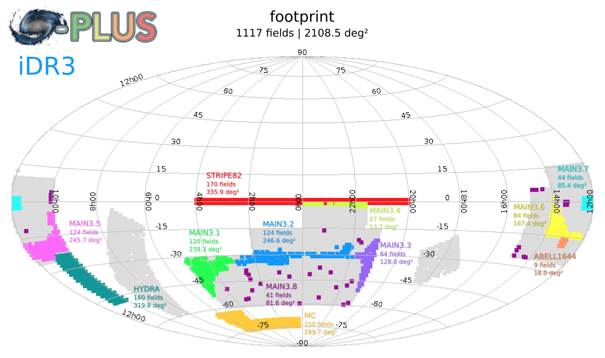

## Source for pip package splusdata

This is a tool mainly to query and download S-PLUS data.

S-PLUS is a survey done with the dedicate T80-South telescope, a robotic 80cm telescope located at Cerro Tololo Interamerican Observatory, in Chile, equipped with a wide-field optical camera. S-PLUS will cover 9300 square degrees of the southern sky. The data generated by S-PLUS consist of images and catalogues prepared by the team at IAG-USP. The data available, iDR3, cover an area of 2000 square degrees and it is now available only for the internal S-PLUS community only. The paper of Mendes de Oliveira et al. (2019, https://arxiv.org/pdf/1907.01567.pdf) describes several aspects of the S-PLUS data, for DR1, which covered the Stripe82 area, but it is extensive to the present data release also. Section 4 of that paper describes  the data reduction pipeline, the production of multi-band data and corresponding photometric catalogues, data calibration strategies, it shows tests of the PSF stability over the images and it explains how the photometry and photometric redshifts were obtained, describing also their depths.

install by running: ::

    pip install splusdata
    
or: ::

    pip3 install splusdata

There is a quick demo showing the functionalities of the package at https://github.com/Schwarzam/splusdata/blob/master/Demonstration.ipynb

These are the data that our internal Data Release 3 cover.

<h3 align="center">All the catalogs are available on Google Drive at: <h3>

https://drive.google.com/drive/folders/1A3rM4K0wgMu5n6OtUJAajoic_QsZZLzu

  

Note that this is a experimental project, it depends on our connection and it may be slow sometimes. 
Any doubts about this tool please write to Gustavo.b.schwarz@gmail.com
